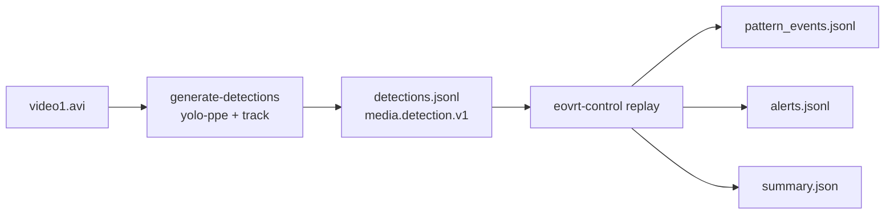

# Reporte de resultados — Pipeline HF/YOLO → Control Plane (video Intel)

**Fecha del run:** 2026-06-26  
**Escenario:** DBE (replay offline)  
**Autor del experimento:** equipo e-OVRT / TFG  

Este documento resume la primera corrida end-to-end del plano de control usando detecciones generadas localmente con YOLO (sin pasar por el plano de medios completo).

---

## 1. Objetivo del experimento

Validar la integración **video → percepción → `detections.jsonl` → replay del control plane → alertas**, usando:

- Un video de obra con EPP visible (dataset Intel / `video1.avi`)
- Backend `yolo-ppe` (modelo construction-site-safety)
- Patrones CR-01 (sin casco) y CR-02 (sin chaleco)
- Tracking IoU para IDs de sujeto estables (`subject_001`, …)

---

## 2. Configuración utilizada

### 2.1 Hardware y entorno

| Parámetro | Valor |
|---|---|
| SO | WSL (Ubuntu) sobre Windows |
| GPU | NVIDIA RTX 4060 Laptop (8 GB) |
| Python | 3.11 (venv del control plane) |
| Torch | CUDA (`--device cuda`) |

### 2.2 Generación de detecciones (percepción)

```bash
cd e-ovrt_control-plane
source .venv/bin/activate

eovrt-control generate-detections \
  --input ../e-ovrt_datasets/datasets/video/video1.avi \
  --output fixtures/hf_media/video_intel/detections.jsonl \
  --backend yolo-ppe \
  --device cuda \
  --stride 2 \
  --track
```

| Parámetro | Valor |
|---|---|
| Backend | `yolo-ppe` |
| Pesos | `models/yolo/construction-site-safety.pt` (descarga automática desde GitHub) |
| Stride | 2 (1 de cada 2 frames) |
| Tracking | `--track` (SimpleIoUTracker) |
| **Media run ID** | `hf-perception-acaa647011` |
| **Unidades generadas** | 976 |

### 2.3 Replay del control plane

```bash
eovrt-control replay configs/replay_hf_video_intel.yaml
```

| Parámetro | Valor |
|---|---|
| Entrada | `fixtures/hf_media/video_intel/detections.jsonl` |
| Patrones | `configs/patterns/cr01_cr02_v1.yaml` |
| Patrones activos | CR-01, CR-02 |
| **Control run ID** | `replay_hf_detections_20260626T025607Z` |

### 2.4 Parámetros relevantes del patrón (`cr01_cr02_v1`)

| Patrón | Región | `confirm_after_frames` | `resolve_after_frames` |
|---|---|---|---|
| CR-01 (sin casco) | upper_body (0–45 % altura) | **1** | 1 |
| CR-02 (sin chaleco) | torso (25–85 % altura) | **1** | 1 |

> **Nota:** `confirm_after_frames: 1` es muy permisivo: basta un solo frame para confirmar la condición y emitir alerta. Esto infla el número de alertas respecto a una evaluación temporal más estricta.

---

## 3. Flujo del pipeline



**Contrato de integración:** archivo JSONL (`media.detection.v1`). No se usa HTTP ni Kafka en esta fase.

---

## 4. Resultados del control run

### 4.1 Resumen (`summary.json`)

| Métrica | Valor |
|---|---|
| Unidades procesadas | **976** |
| Unidades fallidas | **0** |
| Errores | **0** |
| Eventos de patrón | **171** |
| Alertas emitidas | **82** |
| Tiempo total de replay | ~92 ms |
| Tiempo promedio por unidad | ~0.02 ms |
| Patrón activo | `cr01_cr02_v1` |
| Media run asociado | `hf-perception-acaa647011` |

### 4.2 Desglose de alertas

| Patrón | Descripción | Cantidad |
|---|---|---|
| **CR-01** | Persona sin evidencia de casco en región superior | **17** |
| **CR-02** | Persona sin evidencia de chaleco en región torso | **65** |
| **Total** | | **82** |

| Métrica adicional | Valor |
|---|---|
| Pares únicos (patrón + sujeto) | 44 |
| Frames con al menos una alerta | 61 (de 976) |
| Primer frame con alerta | 152 (~5 s @ 30 fps) |
| Último frame con alerta | 1870 (~62 s) |

### 4.3 Sujetos con más alertas CR-02

| Sujeto (`detection_id`) | Alertas CR-02 |
|---|---|
| `subject_023` | 11 |
| `subject_038` | 9 |
| `subject_025` | 8 |
| `subject_008` | 7 |
| `subject_001` | 5 |

---

## 5. Resultados de la capa perceptual

Estadísticas sobre `fixtures/hf_media/video_intel/detections.jsonl`:

| Métrica | Valor |
|---|---|
| Frames sin detecciones | 592 (~61 %) |
| Frames con detecciones | 384 |
| IDs de sujeto únicos | 44 |
| Detecciones `person` | 384 |
| Detecciones `helmet` | 379 |
| Detecciones `vest` | 198 |

**Observación:** el modelo detecta casco con frecuencia similar a persona, pero chaleco (`vest`) aparece en menos de la mitad de los frames con contenido. El control plane no usa directamente la clase `NO-Safety Vest` del YOLO; infiere CR-02 por **ausencia espacial** de `vest` en la región del torso del bbox de la persona.

---

## 6. Comportamiento temporal observado

En `pattern_events.jsonl` se observan ciclos de estado completos:

```text
inactive → confirmed → sustained → resolved
```

### Ejemplo: `subject_001` / CR-02

| Frame | Transición | Efecto |
|---|---|---|
| 152 | inactive → confirmed | 1ª alerta CR-02 |
| 154 | confirmed → sustained | Condición sostenida |
| 218 | sustained → resolved | Sujeto pierde detección unos frames |
| 220 | resolved → confirmed | 2ª alerta CR-02 (re-disparo) |
| … | (ciclos repetidos) | Más alertas del mismo sujeto |

Esto confirma que el **motor de persistencia temporal funciona** según el diseño: resuelve cuando falta evidencia y vuelve a confirmar (y alertar) al reaparecer la condición.

---

## 7. Lectura por tramos del video

| Tramo (aprox.) | Frames | Qué ocurre |
|---|---|---|
| 0–5 s | 0–150 | Sin detecciones → sin alertas |
| 5–12 s | 150–336 | Aparece `subject_001`; varias CR-02; entran más sujetos |
| 12–20 s | 336–600 | Más sujetos (`subject_003`–`012`); CR-01 y CR-02 mezclados |
| 20–45 s | 600–1350 | Tramo más denso; `subject_008`, `023`, `025` con muchas re-alertas |
| 45–62 s | 1350–1870 | `subject_038` y otros; alertas hasta el final |

---

## 8. Interpretación

### 8.1 Lo que funciona bien

1. **Integración end-to-end:** video → YOLO → JSONL → control → alertas, sin errores.
2. **Tracking:** IDs estables en tramos largos (`subject_001` persiste entre frames consecutivos).
3. **Motor temporal:** estados `confirmed`, `sustained` y `resolved` visibles en los logs.
4. **Trazabilidad:** cada alerta enlaza `control_run_id`, `media_run_id`, `frame_index`, `subject_key` y evidencia espacial.
5. **Rendimiento del replay:** ~92 ms para 976 unidades (despreciable frente a la inferencia GPU).

### 8.2 Limitaciones y artefactos del run

1. **Alta tasa de CR-02 (65/82 alertas):** el video Intel muestra trabajadores con chaleco, pero el modelo a menudo no asocia `vest` al torso. Las alertas CR-02 reflejan **fallo de percepción/asociación espacial**, no necesariamente violación real de EPP.

2. **Alertas repetidas:** con `confirm_after_frames: 1`, cada ciclo `resolved → confirmed` genera una nueva alerta. Un mismo sujeto puede acumular 5–11 alertas.

3. **Fragmentación de IDs:** 44 `subject_XXX` para pocos trabajadores reales sugiere que oclusiones, bboxes inestables o `stride 2` provocan IDs nuevos para la misma persona física.

4. **Frames vacíos (61 %):** los primeros ~5 s no hay detecciones; el modelo tarda en “enganchar” sujetos.

5. **Configuración permisiva:** `cr01_cr02_v1` está pensado para smoke tests, no para evaluación cuantitativa rigurosa.

---

## 9. Conclusiones

| Pregunta | Respuesta |
|---|---|
| ¿El control plane procesa evidencia HF/YOLO correctamente? | **Sí** |
| ¿La persistencia temporal opera como se diseñó? | **Sí** |
| ¿Las alertas reflejan riesgo real en este video? | **Dudoso** — dominan falsos positivos de CR-02 por percepción |
| ¿Sirve como smoke test de integración? | **Sí** — excelente validación del pipeline |
| ¿Sirve como benchmark cuantitativo? | **No aún** — requiere ground truth y patrón temporal más estricto |

**Conclusión general:** el experimento demuestra que el plano de control está listo para consumir evidencia perceptual real generada fuera del media plane. La calidad de las alertas en producción dependerá críticamente de la calidad del detector, el tracking y la configuración temporal de los patrones.

---

## 10. Artefactos generados

```
e-ovrt_control-plane/
├── fixtures/hf_media/video_intel/
│   └── detections.jsonl              # entrada perceptual (976 unidades)
├── models/yolo/
│   └── construction-site-safety.pt   # pesos YOLO (gitignored, descarga local)
└── runs/replay_hf_detections_20260626T025607Z/
    ├── summary.json                  # métricas agregadas
    ├── alerts.jsonl                  # 82 alertas
    ├── pattern_events.jsonl          # 171 transiciones de estado
    ├── metrics.jsonl
    ├── errors.jsonl                  # vacío
    └── effective_config.yaml         # config efectiva del run
```

---

## 11. Próximos pasos sugeridos

### 11.1 Reducir ruido en alertas

Replay con patrón temporal más estricto (`confirm_after_frames: 3`):

```bash
# Editar configs/replay_hf_video_intel.yaml:
#   patterns.file: patterns/cr01_cr02_temporal_eval.yaml
eovrt-control replay configs/replay_hf_video_intel.yaml
```

### 11.2 Mejorar calidad perceptual

- Subir `--confidence` al generar (p. ej. `0.35` o `0.40`) para filtrar bboxes débiles.
- Comparar backend `gdino` (open-vocabulary) frente a `yolo-ppe`.
- Evaluar `stride 1` si el tracking fragmenta demasiado los IDs.

### 11.3 Validación cuantitativa

- Correr el fixture sintético (`fixtures/simulated_media/cr01_cr02_temporal/`) donde el ground truth es conocido (objetivo: F1 = 1.0).
- Anotar manualmente un subconjunto de frames del video Intel y medir precisión/recall por patrón.

### 11.4 Inspección visual

Frames sugeridos para revisar en el video junto con `alerts.jsonl`:

| Frame | Timestamp aprox. | Motivo |
|---|---|---|
| 152 | ~5 s | Primera alerta CR-02 (`subject_001`) |
| 338 | ~11 s | Alerta CR-01 (`subject_007`, bbox angosta) |
| 600 | ~20 s | Tramo denso de sujetos |
| 1200 | ~40 s | Re-alertas recurrentes |

---

## 12. Referencias internas

- Generador de detecciones: `src/eovrt_control/perception/`
- CLI: `eovrt-control generate-detections`
- Config replay: `configs/replay_hf_video_intel.yaml`
- Patrones: `configs/patterns/cr01_cr02_v1.yaml`, `cr01_cr02_temporal_eval.yaml`
- Guía de fixtures HF: `fixtures/hf_media/README.md`
- Arquitectura: `docs/architecture.md`

---

*Documento generado a partir del análisis del run `replay_hf_detections_20260626T025607Z`.*
